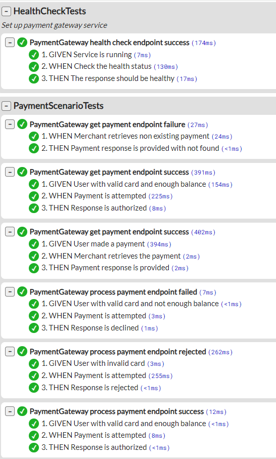

## Project structure
```
src/
    PaymentGateway.Api - web api exposing two endpoints in payments controller, contains DI setup, validation logic, middleware
    PaymentGateway.Contracts - Contains request and response models of api. Separated so that it is indepedent and can be exposed a package if needed
    PaymentGateway.Clients - Contains external service dependencies, in this case client for Bank Simulator
    PaymentGateway.Domain - Contains core business logic
    PaymentGateway.Data - Contains data models and payments repository
test/
    PaymentGateway.Api.UnitTests - unit tests for Api project
    PaymentGateway.Clients.UnitTests - unit tests for clients project. Used MockHttpHandler for mocking simulator
    PaymentGateway.Domain.UnitTests - unit tests for domain project
    PaymentGateway.Data.UnitTests - unit tests for data project
    PaymentGateway.ServiceTests - a test project that runs scenario tests against api in behaviour driven style. Used LightBDD and Wiremock packages.
    
FeaturesReport.html - shows the service test report in user friendly manner.
    
imposters/ - contains the bank simulator configuration. Don't change this

.editorconfig - don't change this. It ensures a consistent set of rules for submissions when reformatting code
docker-compose.yml - configures the bank simulator
PaymentGateway.sln
```

## Design Choices
- Introduced PaymentType in input request for extensibility
- Validation through filters and kept in api layer as it's not domain concern
- Clients project for external dependencies
- Contracts as a separate project so it can be packaged and shared
- Error handling middleware to keep centralised exception handling and controllers clean
- Service tests that demonstrate full service use cases tested. Report attached at root by name `FeaturesReport.html`
## Known limitations
- Used `int` for month for easier validation but due to this can't really provide input as 01
## Useful next steps
- Polly for retries 
- Handling other error scenarios for dependency 
- Endpoint to return last 10 transactions for ease of use 
- User friendly payment id

## Service test report


# Instructions for candidates

This is the .NET version of the Payment Gateway challenge. If you haven't already read the [README.md](https://github.com/cko-recruitment) in the root of this organisation, please do so now. 
